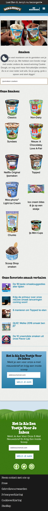

# Procesverslag
Markdown is een simpele manier om HTML te schrijven.  
Markdown cheat cheet: [Hulp bij het schrijven van Markdown](https://github.com/adam-p/markdown-here/wiki/Markdown-Cheatsheet).

Nb. De standaardstructuur en de spartaanse opmaak van de README.md zijn helemaal prima. Het gaat om de inhoud van je procesverslag. Besteedt de tijd voor pracht en praal aan je website.

Nb. Door *open* toe te voegen aan een *details* element kun je deze standaard open zetten. Fijn om dat steeds voor de relevante stuk(ken) te doen.

## Jij

  
uitwerken voor kick-off werkgroep

  ### Auteur:
  Ouiam El Malki

  #### Je startniveau:
  Startniveau is blauw

  #### Je focus:
  surface laag
 

## Je website

  
uitwerken voor kick-off werkgroep

  ### Je opdracht:
  link naar de website die je gaat namaken óf de naam/omschrijving van je eigen ontwerp
  https://www.benjerry.nl/

  #### Screenshot(s) van de eerste pagina (small screen): 
  Home pagina
  

  #### Screenshot(s) van de tweede pagina (small screen):
  Smaken pagina  
  
 

## Toegankelijkheidstest 1/2 (week 1)

  
uitwerken na test in 1e werkgroep

  ### Bevindingen
  Lijst met je bevindingen die in de test naar voren kwamen:
  - Door de site heen browsen doormiddel van de touch-pad gaat lastig
  - Het is niet mogelijk om de navigatie te skippen met tab en screenreader
  

  #### Screenreader
  Hier korte omschrijving (met indien nodig afbeeldingen)
  Door de site heen browsen met de screenreader is mogelijk, alleen is het niet mogelijk om de navigatie en hamburger menu te skippen om meteen naar de content te gaan. Dat kan verbeterd worden. Door middel van een skip to content knop die je meteen naar de content lijdt in plaats van de hamburger menu.

  #### Muis en Toetsenbord 
  Hier korte omschrijving (met indien nodig afbeeldingen)
  De site gebruiker door middel van de muis en toetsenbord gaat goed. Daar zijn geen aspecten die verbeterd hoeven te worden.

  #### Motoriek (shocks, elastiekjes)
  Hier korte omschrijving (met indien nodig afbeeldingen)
  De site gebruiken met een shock apparaat om is wel lastiger. Vooral door de site browsen met het touchpad en tegelijkertijd een shock apparaat je om hebben is mijn niet mogelijk. Dus hier zou dan gebruik gemaakt kunnen worden van tab in plaats van het touchpad.

  #### Visueel (brillen, contrast, kleurenblind, dark/light). 
  Hier korte omschrijving (met indien nodig afbeeldingen)
  De kleurcontrasten in de huidige pagina zijn wel goed. Mensen met een visuele beperking kunnen de zwart op wit content goed zien. En bijvoorbeeld gele elementen in de content weer minder goed.

## Breakdownschets (week 1)

  
uitwerken na afloop 2e werkgroep

  
  ### de hele pagina: 
  

  ### dynamisch deel (bijv menu): 
  

## Voortgang 1 (week 2)

  
uitwerken voor 1e voortgang

  ### Stand van zaken
  Website volledig voorzien van HTML. Css nog niet aan begonnen en java ook niet.
  Hoop zo snel mogelijk aan css te kunnen beginnen. 2e pagina is helemaal niet af.

  ### Agenda voor meeting
  samen met je groepje opstellen

 Ouiam:  
  CSS verder verwerken.
  Tekst op afbeeldingen plaatsen.
  Font over de hele pagina.
  
 Isa:
 Omar:
 Cherlyn:

  ### Verslag van meeting
   hier na afloop snel de uitkomsten van de meeting vastleggen

  - Structuur van html controleren. Goed
  - Structuur van CSS controleren. Goed
  - h2 position; absolute het beste niet gebruiken zodat afbeeldingen niet in elkaar schuiven.    
  - In een section niet nog een section gebruiken maar een articel, is beter.

## Voortgang 2 (week 3)

  
uitwerken voor 2e voortgang

  ### Stand van zaken
 Html en css van homepage volledig af. Inclusief hamburger menu. Moet nog animaties in verwerken.
 Smaken pagina ga ik vandaag proberen te maken

  ### Agenda voor meeting
  samen met je groepje opstellen

  Ouiam:
  Isa:
  Cherlyn:
  Omar:

  ### Verslag van meeting
  - Ik had een button in een ul  gezet en gevraagd aan de assistent of dat wel mag. Het was beter om de ul in een section te zetten en dan de button in de section.
  - Voor de rest heb alles netjes er in kunnen verwerken qua html, css en java

## Toegankelijkheidstest 2/2 (week 4)

  
uitwerken na test in 8e werkgroep

  ### Bevindingen
  Lijst met je bevindingen die in de test naar voren kwamen (geef ook aan wat er verbeterd is):
  Bevindingen van de verbeterde Ben en Jerry site zijn dat je al gebruiker nu gemakkelijker tab kan gerbuiken voor als je door de site heen browst. 

  #### Screenreader
  Hier korte omschrijving (met indien nodig afbeeldingen)
  De screenreader gebruiken tijdens het browsen door de site is gemakkelijk en goed. Ook heeft elke img alt tekst dat meer informatie geeft aan de gebruiker over de desbetreffende afbeeling.

  #### Muis en Toetsenbord 
  Hier korte omschrijving (met indien nodig afbeeldingen)
  De muis en toetsenbord gebruiker om door de site heen te browsen gaat soepel en goed. Tab gaat langs alle link attributen.

  #### Motoriek (shocks, elastiekjes)
  Hier korte omschrijving (met indien nodig afbeeldingen)
  Met het toetsenbord werken om door de site heen te browsen terwijl er een motoriek mankement is, gaat goed en gemakkelijk.

  #### Visueel (brillen, contrast, kleurenblind, dark/light). 
  Hier korte omschrijving (met indien nodig afbeeldingen)
  De site heeft dezelfde kleurcontrasten als de originele Ben en Jerry site. Dus veel content is goed leesbaar voor slechtziende.

## Voortgang 3 (week 4)

  
uitwerken voor 3e voortgang

  ### Stand van zaken
  Html,css en java voor beide pagina's zijn volledig af. Ook heb ik 5 surface elementen kunnen verwerken. 
 1 Animatie van een koe en santa
 2 States van controls++ (forms, inputs, links…)
 3 Video/Geluid
 4 Advanced positioning: sticky, fixed, z-index…
 5 Custom properties++ (voor meer dan kleur, aanpassen met JS…)

  ### Agenda voor meeting
  samen met je groepje opstellen

  Ouiam:
  Isa:
  Cherlyn:
  Omar:

  ### Verslag van meeting
  hier na afloop snel de uitkomsten van de meeting vastleggen

  - beter span kunnen gebruiken 
  - voor data beter time tag gebruiken
  - in articles h3 gebruiken in plaats van h2

## Eindgesprek (week 5)

  
uitwerken voor eindgesprek

  ### Je uitkomst - karakteristiek screenshots:
  

  ### Dit ging goed/Heb ik geleerd: 
  Korte omschrijving met plaatjes

  

  ### Dit was lastig/Is niet gelukt:
  Korte omschrijving met plaatjes

  

## Bronnenlijst

  
continu bijhouden terwijl je werkt

  Nb. Wees specifiek ('css-tricks' als bron is bijv. niet specifiek genoeg).

bronnenlijst voor de homepagina:
images: https://www.benjerry.nl/ & extract.pics
colors: https://www.benjerry.nl/
font: https://eng.m.fontke.com/font/62486515/download/
button css styling: https://www.w3schools.com/css/css3_buttons.asp
tekst op images: https://codepen.io/shooft/pen/jOKzRoK
media queries: https://css-tricks.com/a-complete-guide-to-css-media-queries/
hr: https://www.w3schools.com/howto/howto_css_style_hr.asp
button: https://www.w3schools.com/css/css3_buttons.asp
koe foto: https://www.benjerry.com/whats-new/2016/most-interesting-cow
koe animatie: https://codepen.io/shooft/pen/KKorGPa?editors=1100
santa img: https://www.vecteezy.com/vector-art/5346727-santa-claus-on-sleigh-with-reindeer-flying-in-the-sky-at-night
skip link: https://www.freecodecamp.org/news/how-to-add-skip-to-main-content-links-to-a-website/

bronnenlijst voor de smakenpagina:
images: https://www.benjerry.nl/ & extract.pics
colors: https://www.benjerry.nl/
font: https://eng.m.fontke.com/font/62486515/download/
button css styling: https://www.w3schools.com/css/css3_buttons.asp
tekst op images: https://codepen.io/shooft/pen/jOKzRoK
media queries: https://css-tricks.com/a-complete-guide-to-css-media-queries/
hr: https://www.w3schools.com/howto/howto_css_style_hr.asp
button: https://www.w3schools.com/css/css3_buttons.asp
grid voor smaken lijst: https://codepen.io/shooft/pen/gOKzzBM
image styling: https://www.w3schools.com/css/css3_images.asp
iframe: https://www.w3schools.com/html/html_iframe.asp
box-shadow-top: https://stackoverflow.com/questions/9792816/apply-drop-shadow-to-border-top-only

